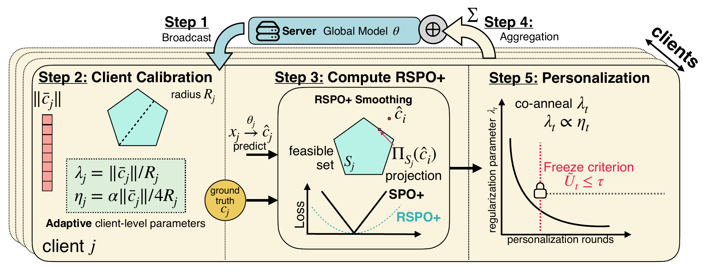

# FedRSPO+



Code for **[FedRSPO+: A Heterogeneity-aware Algorithm for Decision-focused Federated Learning](https://openreview.net/forum?id=zbsbqMhkWi)**, accepted at **NeurIPS 2026**.

**Konstantinos Ziliaskopoulos, Alexander Vinel, and Jiaqi Wang**

The repository includes synthetic knapsack, Warcraft shortest-path, and PJM battery-dispatch experiments, plus the PJM leave-one-client-out (LOCO) and fixed-demand ablations and the Interp-DFFL and OptNet baselines.

## Setup

- Julia 1.12 (the environment is pinned in `Manifest.toml`).
- Gurobi installed with a license available to Julia.
- For Warcraft only, download the one-skin dataset from the [original benchmark repository](https://github.com/martius-lab/blackbox-differentiation-combinatorial-solvers) and place its `12x12` folder at `src/data/warcraft_shortest_path_oneskin/12x12/`. It should contain `info.json` and the `train_*`, `val_*`, and `test_*` NumPy files for maps, shortest paths, and vertex weights. Warcraft data is not bundled.

Run all commands from the repository root. Install the Julia dependencies once:

```bash
julia --project=. -e 'using Pkg; Pkg.instantiate()'
```

The raw PJM data is included. PJM runners generate the derived CSVs on first use; synthetic data is generated from the experiment seed.

## Main experiments

```bash
# Experiment 1: synthetic knapsack
julia --project=. scripts/experiments/synth_run.jl

# Experiment 2: Warcraft shortest path
julia --project=. scripts/experiments/warcraft_run.jl

# Experiment 3: PJM battery dispatch
julia --project=. scripts/experiments/pjm_sweep_run.jl
```

The runners contain the experiment defaults and accept flags for seeds, objectives, hyperparameters, and output locations.

## PJM ablations

LOCO excludes each target client from federated training and validation, then compares the donor model, target personalization, and local-only training with 3, 7, 14, 30, and 60 labeled target days:

```bash
julia --project=. scripts/experiments/pjm_cold_start_run.jl
```

Target validation and test sets stay fixed across budgets. Target feature normalization uses the full prevalidation feature history, without target labels. Use `--target-client-ids 1 --seed-values 42 --train-days 3,7 --nprocs 1` for a smaller run.

Fixed-demand experiments assign the same dispatch demand to every PJM client and compare MSE, SPO+, and the FedRSPO+ components:

```bash
for demand in 4 6 8 10 12; do
  julia --project=. scripts/experiments/pjm_ablation_run.jl \
    --fixed-demand "$demand" --outdir "results/experiment3/pjm_fixed_demand_$demand"
done
```

Omit `--fixed-demand` to run the component ablation with the original client demands. These PJM ablation runners and the PJM Interp-DFFL runner accept `--seed-values`, `--nprocs` (`1` for serial execution), `--outdir`, and `--help`.

## Baselines

Interp-DFFL trains local and federated SPO+ models, then selects per-client prediction interpolation weights using SPO+ or MSE calibration loss. The synthetic experiment uses an 80/20 fit/calibration split within each client's training data; PJM uses its chronological validation split.

```bash
julia --project=. scripts/experiments/synth_interp_dffl_run.jl
julia --project=. scripts/experiments/pjm_interp_dffl_run.jl
```

OptNet is implemented as an implicitly differentiated quadratic-program layer using DiffOpt and Gurobi, named `id_qp` in the code. It tunes the quadratic regularization on validation data and evaluates decisions with the original linear optimization objective.

```bash
# Run synthetic knapsack and PJM, or select either dataset
julia --project=. scripts/experiments/id_qp_run.jl --datasets synthetic,pjm
```

For a quick synthetic check, use `--smoke` with `synth_interp_dffl_run.jl`, or `--smoke --datasets synthetic` with `id_qp_run.jl`. Both runners support `--help`.

## Layout and results

- `Project.toml`, `Manifest.toml`: Julia environment.
- `scripts/experiments/*_run.jl`: experiment entrypoints; `*_worker.jl`: supporting training jobs.
- `src/datagen/`: dataset loading and generation.
- `src/models/`: objectives, training, schedules, optimization oracles, and Interp-DFFL.
- `src/baselines/id_qp.jl`: OptNet baseline.
- `src/experiments/`: evaluation and export helpers.
- `src/data/exp3/pjm_data.csv`: raw PJM data.

Runs write metrics and experiment artifacts under `results/experiment1/`, `results/experiment2/warcraft/`, and `results/experiment3/`. OptNet writes to `results/additional_baselines/id_qp/`. Generated results, derived data, and external dataset downloads are ignored by Git.

## Citation

The paper is accepted; the proceedings entry is forthcoming. Use this BibTeX until the final bibliographic details are available:

```bibtex
@inproceedings{ziliaskopoulos2026fedrspo,
  author    = {Konstantinos Ziliaskopoulos and Alexander Vinel and Jiaqi Wang},
  title     = {{FedRSPO+}: A Heterogeneity-aware Algorithm for Decision-focused Federated Learning},
  booktitle = {Advances in Neural Information Processing Systems},
  volume    = {39},
  year      = {2026},
  note      = {Accepted at NeurIPS 2026; proceedings forthcoming},
  url       = {https://openreview.net/forum?id=zbsbqMhkWi}
}
```
